# Project2 项目学习指南（详细版 · 带代码对照）

> 面向：**只有 C# 基础、0 C++ / 图形 API 经验**  
> 用法：按章节顺序读，看到「👉 打开代码」就去对应文件看那一行。

---

## 目录

- [0. 30 秒看懂这个项目](#0-30-秒看懂这个项目)
- [1. 文件地图（删掉了 polygon）](#1-文件地图删掉了-polygon)
- [2. 总流程图：从双击 exe 到看见画面](#2-总流程图从双击-exe-到看见画面)
- [3. 启动阶段：main.cpp](#3-启动阶段maincpp)
- [4. 初始化阶段：application.cpp](#4-初始化阶段applicationcpp)
- [5. 游戏循环：Update 和 Draw](#5-游戏循环update-和-draw)
- [6. 显卡层：direct3d.cpp](#6-显卡层direct3dcpp)
- [7. 图片层：textureManager.cpp](#7-图片层texturemanagercpp)
- [8. 着色器层：shader + hlsl](#8-着色器层shader--hlsl)
- [9. 绘制层：sprite.cpp（核心）](#9-绘制层spritecpp核心)
- [10. 一帧画面的完整数据流](#10-一帧画面的完整数据流)
- [11. 当前 application 里三行画图的参数拆解](#11-当前-application-里三行画图的参数拆解)
- [12. C# 程序员必看的 C++ 差异](#12-c-程序员必看的-c-差异)
- [13. 名词表](#13-名词表)
- [14. 建议学习顺序（带代码作业）](#14-建议学习顺序带代码作业)

---

## 0. 30 秒看懂这个项目

**做了什么：** 开一个 Windows 窗口 → 加载 png 图片 → 每帧画背景（横向滚动）+ 画 COCO 角色。

**和 Unity 对比：**


| 你想做的事  | Unity          | 本项目代码位置                                  |
| ------ | -------------- | ---------------------------------------- |
| 程序入口   | 自动             | `main.cpp` → `WinMain`                   |
| 每帧更新   | `Update()`     | `application.cpp` → `Application_Update` |
| 每帧绘制   | 自动渲染           | `application.cpp` → `Application_Draw`   |
| 显示图片   | SpriteRenderer | `sprite.cpp` → `Sprite_Draw`             |
| 加载 png | Resources.Load | `textureManager.cpp` → `Texture_Load`    |


---

## 1. 文件地图（删掉了 polygon）

```
Project2/
├── main.cpp                 ← 入口、窗口、消息循环
├── application.cpp / .h     ← 你的游戏内容（加载什么、每帧画什么）
├── direct3d.cpp / .h        ← 显卡初始化、清屏、显示到屏幕
├── shader.cpp / .h          ← 加载 .cso 着色器
├── shader_vertex_2d.hlsl    ← 顶点着色器源码（GPU 算位置）
├── shader_pixel_2d.hlsl     ← 像素着色器源码（GPU 算颜色）
├── textureManager.cpp / .h  ← 加载/管理 png
├── sprite.cpp / .h          ← 画一张 2D 图片（最核心）
├── WICTextureLoader11.*     ← 微软工具：读 png 文件
├── bg.png / coco.png / miku.png  ← 图片（放 exe 同目录）
└── 项目学习指南.md          ← 你正在看的这个文件
```

**模块谁调用谁：**

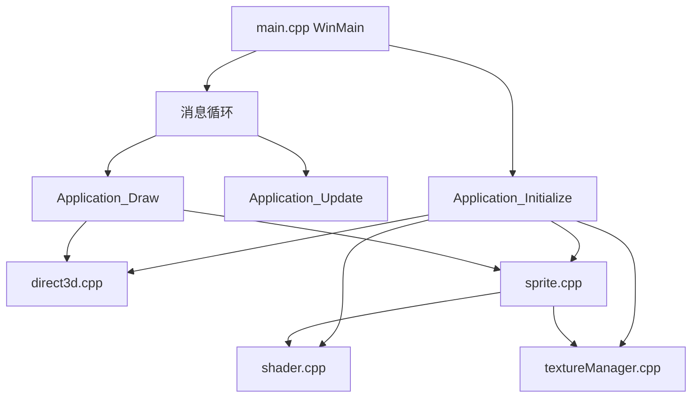


---

## 2. 总流程图：从双击 exe 到看见画面

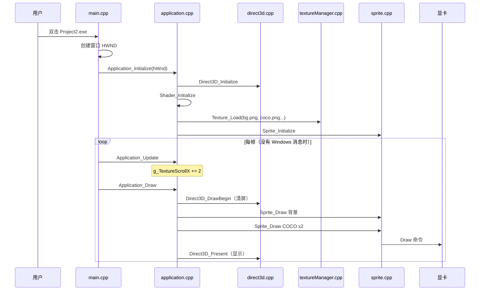


**记住这条主线：**

```
初始化一次 → 循环 { Update改数据 → Draw画图 → Present显示 }
```

---

## 3. 启动阶段：main.cpp

### 3.1 程序入口 WinMain

👉 打开代码：`main.cpp` 第 35 行起

```35:47:main.cpp
int APIENTRY WinMain(_In_ HINSTANCE hInstance, _In_opt_ HINSTANCE,
	_In_ LPSTR, _In_ int nCmdShow)
{
	(void)CoInitializeEx(nullptr, COINIT_MULTITHREADED);
	// ...
```


| 步骤      | 代码行     | 干什么                            | C# 类比            |
| ------- | ------- | ------------------------------ | ---------------- |
| 初始化 COM | 47      | 读 png 等需要 COM                  | 类似初始化某个系统服务      |
| 注册窗口类   | 54-67   | 告诉 Windows 窗口长什么样              | 定义 Window 模板     |
| 创建窗口    | 86-93   | 得到 `HWND`（窗口 ID）               | `new Form()`     |
| 初始化游戏   | 97      | `Application_Initialize(hWnd)` | 你的 `Awake/Start` |
| 显示窗口    | 100-101 | `ShowWindow`                   | `form.Show()`    |


**HWND 是什么？** 窗口的唯一 ID。后面 Direct3D 必须知道「画在哪个窗口上」，所以要把 `hWnd` 传下去。

👉 创建窗口的代码：

```86:93:main.cpp
	HWND hWnd = CreateWindow(
		WINDOW_CLASS, 
		TITLE, 
		WS_OVERLAPPEDWINDOW & ~(WS_THICKFRAME | WS_MAXIMIZEBOX),
		window_x, window_y, 
		WINDOW_WIDTH,WINDOW_HEIGHT,
		nullptr, nullptr, hInstance, nullptr);
```

### 3.2 消息循环（游戏循环的「外壳」）

👉 打开代码：`main.cpp` 第 106-116 行

```106:116:main.cpp
	do {
		if (PeekMessage(&msg, nullptr, 0, 0, PM_REMOVE)) {
			TranslateMessage(&msg);
			DispatchMessage(&msg);
		}
		else { 
			Application_Update();
			Application_Draw();
		}
	} while (msg.message != WM_QUIT);
```

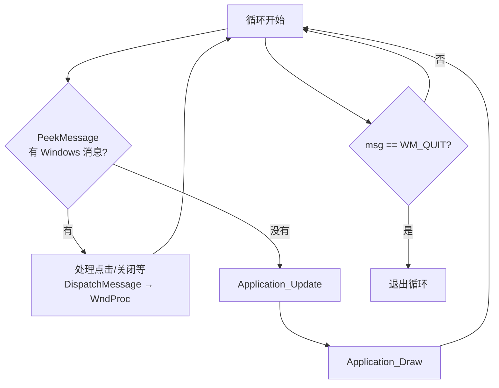


**和 Unity 的区别：**

- Unity：`Update()` 每帧自动调用
- 这里：只有「Windows 没消息」时才跑 `Update/Draw`（CPU 空闲时画游戏）

### 3.3 窗口事件 WndProc

👉 打开代码：`main.cpp` 第 128 行起


| 消息           | 何时触发 | 代码里做什么                 |
| ------------ | ---- | ---------------------- |
| `WM_CLOSE`   | 点 X  | 弹确认框                   |
| `WM_DESTROY` | 窗口销毁 | `PostQuitMessage` 结束循环 |


---

## 4. 初始化阶段：application.cpp

### 4.1 初始化顺序（必须按这个顺序！）

👉 打开代码：`application.cpp` 第 17-35 行

```17:35:application.cpp
bool Application_Initialize(HWND hWnd)
{
	if (!Direct3D_Initialize(hWnd)) {
		return false;
	}
	Shader_Initialize(Direct3D_GetDevice(), Direct3D_GetDeviceContext());
	Texture_Initialize(Direct3D_GetDevice(), Direct3D_GetDeviceContext());
	
	g_TextureId_bg = Texture_Load(L"bg.png");
	g_TextureId1 = Texture_Load(L"miku.png");
	g_TextureId2 = Texture_Load(L"miku.png");
	g_TextureId_Coco = Texture_Load(L"coco.png");

	Sprite_Initialize();

	return true;
}
```


**为什么有顺序？**

1. **先 D3D**：没有显卡接口，什么都创建不了
2. **再 Shader**：画东西需要着色器
3. **再 Texture**：需要 D3D Device 才能把 png 上传到显卡
4. **最后 Sprite**：需要 Device 创建顶点缓冲、采样器等

### 4.2 纹理 ID 是什么？

👉 打开代码：`application.cpp` 第 8-13 行

```8:13:application.cpp
static int g_TextureId_bg{ TEXTURE_INVALID_ID };
static int g_TextureId1{ TEXTURE_INVALID_ID };
static int g_TextureId2{ TEXTURE_INVALID_ID };
static int g_TextureId_Coco{ TEXTURE_INVALID_ID };
static float g_TextureScrollX{ 0.0f };
```

- `g_` = 全局变量（global）
- 不直接拿图片对象，只存 **int 编号**
- 类似：数据库里用 `id=3` 代表某张图，而不是每次都传整张图

`Texture_Load` 成功返回 `0, 1, 2...`，失败返回 `-1`（`TEXTURE_INVALID_ID`）。

### 4.3 释放顺序

👉 打开代码：`application.cpp` 第 37-42 行

```37:42:application.cpp
void Application_Finalize()
{
	Sprite_Finalize();
	Shader_Finalize();
	Direct3D_Finalize();
}
```

**先释放 Sprite/Shader，最后释放 D3D**（和初始化相反）。

---

## 5. 游戏循环：Update 和 Draw

### 5.1 Update — 只改数据，不画

👉 打开代码：`application.cpp` 第 45-48 行

```45:48:application.cpp
void Application_Update()
{
	g_TextureScrollX += 2.0f;
}
```

每帧背景横向滚动 +2 像素。  
类比 Unity：`transform.position.x += 2;`（这里还没用 deltaTime）。

### 5.2 Draw — 只画，不改逻辑

👉 打开代码：`application.cpp` 第 50-63 行

```50:63:application.cpp
void Application_Draw()
{
	Direct3D_DrawBegin();

	Sprite_Draw(g_TextureId_bg, 0.0f, 0.0f, (float)SCREEN_WIDTH, (float)SCREEN_HEIGHT, (int)g_TextureScrollX, 0, SCREEN_WIDTH, (int)Texture_GetHeight(g_TextureId_bg));
	Sprite_Draw(g_TextureId_Coco, 0.0f, 0.0f, 64.0f, 64.0f, 0, 0, 32, 32);
	Sprite_Draw(g_TextureId_Coco, 500.0f, 520.0f, 128.0f, 128.0f, 0, 0, 32, 32, DirectX::XMFLOAT4(0.0f, 0.5f, 0.7f, 0.8f));

	Direct3D_Present();
}
```

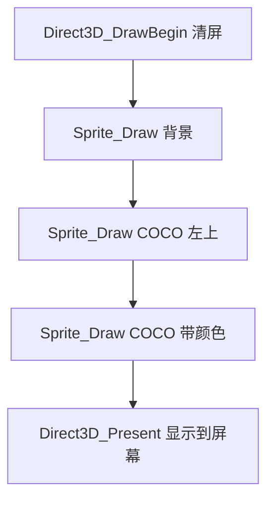


**绘制顺序 = 图层顺序：** 先画的在下层，后画的盖住先画的。

---

## 6. 显卡层：direct3d.cpp

### 6.1 屏幕坐标常量

👉 打开代码：`direct3d.h` 第 15-16 行

```15:16:direct3d.h
static const int SCREEN_WIDTH = 1600;
static const int SCREEN_HEIGHT = 900;
```

游戏内部坐标系：

```
(0,0) ────────────── (1600,0)
  │                      │
  │     游戏画面区域      │
  │                      │
(0,900) ──────────── (1600,900)
```

Y 轴向下，和 Unity 的屏幕坐标类似。

### 6.2 先搞懂：画一幅画需要哪些东西？

在讲代码之前，先用**完全不涉及显卡术语**的方式理解：

想象你在**画动画**：

```
1. 你有一张画布（Buffer）—— 像素格子，1600×900
2. 你有一支笔（GPU）—— 负责把颜色涂上去
3. 你和笔之间需要一个传话的人（API）—— 你下命令，笔去画
4. 画完不能立刻给观众看（会闪）—— 所以有两张画布轮流用（双缓冲）
5. 画好了再「翻页」给观众看（Present）
```

**Direct3D 就是把上面这套流程，用 C++ 对象表达出来。**

---

### 6.3 三个核心对象（零基础版）

👉 打开代码：`direct3d.cpp` 第 18-25 行

```18:25:direct3d.cpp
static ID3D11Device* g_pDevice{ nullptr };
static ID3D11DeviceContext* g_pDeviceContext{ nullptr };
static IDXGISwapChain* g_pSwapChain {nullptr};

static ID3D11RenderTargetView* g_pRenderTargetView = nullptr;
static ID3D11Texture2D* g_pDepthStencilBuffer = nullptr;
static ID3D11DepthStencilView* g_pDepthStencilView = nullptr;
```

#### 6.3.1 Device（设备）— 工厂


|           |                                                                           |
| --------- | ------------------------------------------------------------------------- |
| **是什么**   | 和**显卡驱动**对话的「工厂管理员」                                                       |
| **干什么**   | **创建**各种显卡上的东西：纹理、缓冲、着色器……                                                |
| **不干什么**  | 一般不直接执行「画这一笔」                                                             |
| **C# 类比** | 像 `new Texture2D()` / `new Mesh()` 时背后那个**能分配显存**的系统                      |
| **本项目谁用** | `textureManager.cpp` 创建纹理；`sprite.cpp` 创建顶点缓冲；`createBackBuffer()` 创建深度缓冲 |


```cpp
g_pDevice->CreateTexture2D(...);   // 工厂：造一块显存
g_pDevice->CreateBuffer(...);      // 工厂：造顶点缓冲
```

#### 6.3.2 DeviceContext（设备上下文）— 工人


|           |                                                                |
| --------- | -------------------------------------------------------------- |
| **是什么**   | 真正**执行绘制命令**的工人                                                |
| **干什么**   | 清屏、绑定纹理、调用 Draw、设置视口……                                         |
| **C# 类比** | Unity 里你看不见的 **Graphics 执行层**——你调 `Graphics.DrawMesh`，真正发命令的是它 |
| **本项目谁用** | `sprite.cpp` 里大量 `Direct3D_GetDeviceContext()->Draw(...)`      |


```cpp
g_pDeviceContext->ClearRenderTargetView(...);  // 工人：擦掉画布
g_pDeviceContext->Draw(4, 0);                  // 工人：画！
```

**一句话区分：**

```
Device         = 造东西（CreateXXX）
DeviceContext  = 用东西、画东西（Clear / Draw / SetXXX）
```

#### 6.3.3 SwapChain（交换链）— 双缓冲翻页器


|           |                                                 |
| --------- | ----------------------------------------------- |
| **是什么**   | 管理**两块（或多块）画布**轮流用的系统                           |
| **为什么需要** | 如果边画边显示，用户会看到「画到一半」的画面 → **闪烁、撕裂**              |
| **怎么工作**  | 你在**后台画布**画完整帧 → `Present()` → 翻到屏幕；同时另一块变成新的后台 |
| **C# 类比** | 没有直接对应；最接近的是**双缓冲的屏幕刷新**，Unity 帮你藏起来了           |


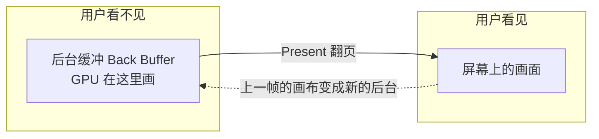


#### 6.3.4 Buffer / Texture / View — 三个容易混的词


| 词               | 通俗意思                    | 比喻                        |
| --------------- | ----------------------- | ------------------------- |
| **Buffer（缓冲）**  | 显卡上的一块**内存**            | 一张「像素格子纸」或「数据仓库」          |
| **Texture（纹理）** | 专门用来存**图片**的 Buffer     | `bg.png` 上传到显卡后就是 Texture |
| **View（视图）**    | 告诉 GPU **怎么用这块 Buffer** | 同一张纸，可以说「当画布用」或「当深度表用」    |


**为什么有 View？**  
显卡上的内存是一块裸数据。GPU 需要知道：这是**颜色画布**还是**深度信息**？View 就是这张「说明书」。

本项目里：


| 变量                      | 是什么              | 干什么                     |
| ----------------------- | ---------------- | ----------------------- |
| `g_pRenderTargetView`   | 颜色画布的 View       | **往这里画** RGB 颜色（你看到的画面） |
| `g_pDepthStencilBuffer` | 深度用的 Buffer      | 记录每个像素「离相机多远」（3D 遮挡用）   |
| `g_pDepthStencilView`   | 深度 Buffer 的 View | 告诉 GPU 这块内存当深度表用        |


> 2D 游戏其实可以不要深度，但 D3D 惯例会一起创建；`sprite.cpp` 里已关闭深度测试。

---

### 6.4 初始化第一步：D3D11CreateDeviceAndSwapChain

👉 打开代码：`direct3d.cpp` 第 33-78 行

这一行函数**一次性**创建：Device + DeviceContext + SwapChain。

```61:73:direct3d.cpp
    HRESULT hr = D3D11CreateDeviceAndSwapChain(
        nullptr,
        D3D_DRIVER_TYPE_HARDWARE,
        nullptr,
        device_flags,
        levels,
        ARRAYSIZE(levels),
        D3D11_SDK_VERSION,
        &swap_chain_desc,
        &g_pSwapChain,
        &g_pDevice,
        &feature_level,
        &g_pDeviceContext);
```

#### 先填「交换链说明书」swap_chain_desc

```37:48:direct3d.cpp
    DXGI_SWAP_CHAIN_DESC swap_chain_desc{};
    swap_chain_desc.Windowed = TRUE;
    swap_chain_desc.BufferCount = 2;
    swap_chain_desc.BufferDesc.Format = DXGI_FORMAT_R8G8B8A8_UNORM;
    swap_chain_desc.BufferUsage = DXGI_USAGE_RENDER_TARGET_OUTPUT;
    swap_chain_desc.SampleDesc.Count = 1;
    swap_chain_desc.SampleDesc.Quality = 0;
    swap_chain_desc.SwapEffect = DXGI_SWAP_EFFECT_FLIP_SEQUENTIAL;
    swap_chain_desc.OutputWindow = window_handle;
```

逐项翻译（**不用背，理解即可**）：


| 字段                  | 值                    | 人话                         |
| ------------------- | -------------------- | -------------------------- |
| `Windowed`          | TRUE                 | 窗口模式（不是全屏独占）               |
| `BufferCount`       | **2**                | **两块画布** → 双缓冲             |
| `BufferDesc.Format` | R8G8B8A8             | 每像素 4 个数：红绿蓝透明度，各 0~255    |
| `BufferUsage`       | RENDER_TARGET_OUTPUT | 这块缓冲的用途 = **当画布/output**   |
| `SampleDesc.Count`  | 1                    | 不做抗锯齿（1 倍采样）               |
| `SwapEffect`        | FLIP_SEQUENTIAL      | 翻页方式（Win10+ 常用）            |
| `OutputWindow`      | `window_handle`      | 画在哪个窗口上（main.cpp 传来的 HWND） |


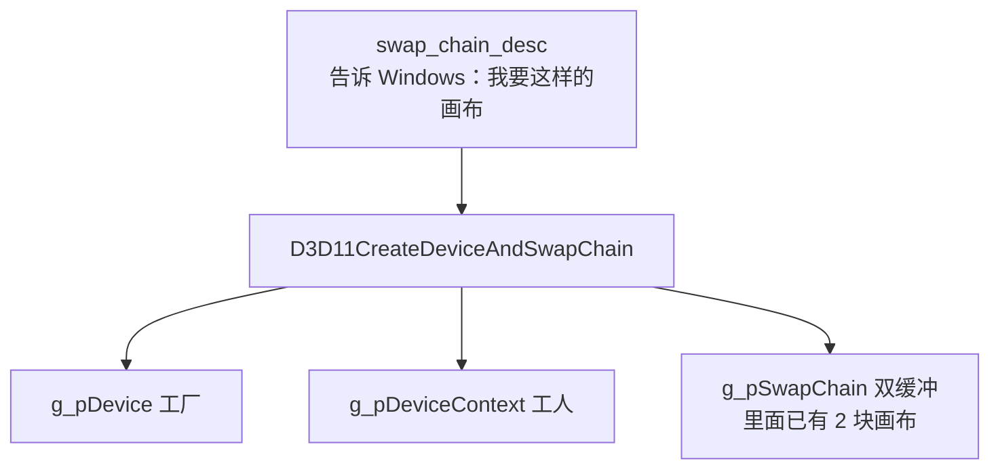


#### 函数参数在要什么（从左到右）


| 参数                         | 含义                     |
| -------------------------- | ---------------------- |
| 第 1 个 `nullptr`            | 用默认显卡（不指定哪张卡）          |
| `D3D_DRIVER_TYPE_HARDWARE` | 用**真实显卡**（不是软件模拟）      |
| `device_flags`             | Debug 时开调试层            |
| `levels`                   | 要 D3D 11.0 / 11.1 功能级别 |
| `&swap_chain_desc`         | 交换链配置（上面的表）            |
| `&g_pSwapChain` 等          | **输出**：创建成功后，指针被填好     |


`HRESULT hr`：返回值，成功失败码。`FAILED(hr)` 就是失败了。

---

### 6.5 初始化第二步：createBackBuffer() 逐行拆解

👉 打开代码：`direct3d.cpp` 第 137-194 行

SwapChain 创建后，**里面已经有画布了**，但你还不能直接用。  
`createBackBuffer()` 做三件事：

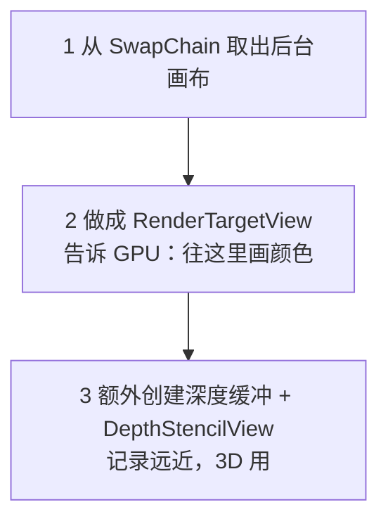


#### 步骤 1：从交换链「取出」后台画布

```139:146:direct3d.cpp
    ID3D11Texture2D* back_buffer_pointer = nullptr;
    hr = g_pSwapChain->GetBuffer(0, __uuidof(ID3D11Texture2D),
        (void**)&back_buffer_pointer);
```


| 代码                    | 人话                                 |
| --------------------- | ---------------------------------- |
| `GetBuffer(0, ...)`   | 向 SwapChain 要**第 0 块**画布（当前用来画的那块） |
| `ID3D11Texture2D`     | 在 D3D 里，**2D 纹理**和**画布**底层是同一类东西   |
| `back_buffer_pointer` | 临时指针，拿到这块显存                        |


#### 步骤 2：做成 RenderTargetView（颜色画布说明书）

```147:155:direct3d.cpp
    hr = g_pDevice->CreateRenderTargetView(back_buffer_pointer, nullptr,
        &g_pRenderTargetView);
```


| 代码                               | 人话                               |
| -------------------------------- | -------------------------------- |
| `CreateRenderTargetView`         | 工厂根据这块缓冲，造一份 **「当颜色输出目标」的 View** |
| `g_pRenderTargetView`            | 保存下来，以后每帧 `Clear` 和 `Draw` 都往这里画 |
| `back_buffer_pointer->Release()` | 临时指针不要了（View 已经引用那块显存）           |


**RenderTarget = 渲染目标 = 画布。**  
`RenderTargetView` = GPU 认得的「画布句柄」。

#### 步骤 3：创建深度缓冲（可选理解，2D 先知道有就行）

```156:174:direct3d.cpp
    D3D11_TEXTURE2D_DESC backBufferDesc{};
    back_buffer_pointer->GetDesc(&backBufferDesc);
    // ...
    depth_stencil_desc.Width = backBufferDesc.Width;
    depth_stencil_desc.Height = backBufferDesc.Height;
    depth_stencil_desc.Format = DXGI_FORMAT_D24_UNORM_S8_UINT;
    depth_stencil_desc.BindFlags = D3D11_BIND_DEPTH_STENCIL;
    hr = g_pDevice->CreateTexture2D(&depth_stencil_desc, nullptr,
        &g_pDepthStencilBuffer);
```


| 代码                      | 人话                     |
| ----------------------- | ---------------------- |
| `GetDesc`               | 读后台画布多大（宽×高）           |
| 新建 `depth_stencil_desc` | 按**同样大小**再申请一块显存       |
| `D24_UNORM_S8_UINT`     | 每个像素存「深度值」（离相机多远）      |
| `BIND_DEPTH_STENCIL`    | 这块内存的用途 = **深度表**，不是颜色 |


```180:187:direct3d.cpp
    hr = g_pDevice->CreateDepthStencilView(g_pDepthStencilBuffer,
        &depth_stencil_view_desc, &g_pDepthStencilView);
```

再为深度缓冲做一份 View → `g_pDepthStencilView`。

**3D 时怎么用深度？** 两个物体重叠时，离相机近的挡住远的。2D 项目里 `sprite.cpp` 关了深度测试，所以深度缓冲**创建了但基本不参与**。

---

### 6.6 初始化第三步：RSSetViewports（视口）

👉 打开代码：`direct3d.cpp` 第 85-95 行

```85:95:direct3d.cpp
    static D3D11_VIEWPORT g_Viewport{};

    g_Viewport.TopLeftX = 0.0f;
    g_Viewport.TopLeftY = 0.0f;
    g_Viewport.Width = (float)SCREEN_WIDTH;
    g_Viewport.Height = (float)SCREEN_HEIGHT;
    g_Viewport.MinDepth = 0.0f;
    g_Viewport.MaxDepth = 1.0f;

    g_pDeviceContext->RSSetViewports(1, &g_Viewport);
```

**视口 = 画布上的「有效绘制区域」。**

```
整个 Back Buffer 可能很大，但视口说：
「请把 0~1600, 0~900 这个矩形，当作我的 2D 坐标范围」
```

这和 `sprite.cpp` 里的投影矩阵是对上的：

```cpp
XMMatrixOrthographicOffCenterLH(0, SCREEN_WIDTH, SCREEN_HEIGHT, 0, 0, 1);
//                              左   右           下          上
```


| 字段                  | 值         | 含义             |
| ------------------- | --------- | -------------- |
| `TopLeftX/Y`        | 0, 0      | 视口左上角在画布上的位置   |
| `Width/Height`      | 1600, 900 | 视口大小 = 游戏分辨率   |
| `MinDepth/MaxDepth` | 0, 1      | 深度范围（2D 几乎不用管） |


---

### 6.7 初始化全流程串起来

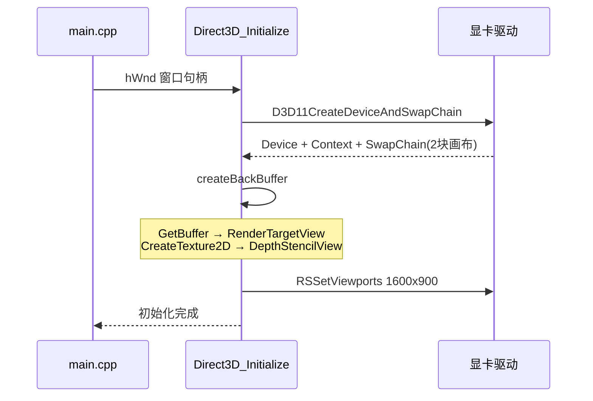


**初始化完成后，你手里有什么：**


| 对象                    | 状态                 |
| --------------------- | ------------------ |
| `g_pDevice`           | 就绪，可以 Create 纹理/缓冲 |
| `g_pDeviceContext`    | 就绪，可以发绘制命令         |
| `g_pSwapChain`        | 有 2 块画布，但还没显示内容    |
| `g_pRenderTargetView` | 知道「往哪画颜色」          |
| `g_pDepthStencilView` | 知道「往哪写深度」          |
| Viewport              | 知道「1600×900 坐标范围」  |


之后每帧：`DrawBegin` 清画布 → `Sprite_Draw` 画 → `Present` 翻页显示。

---

### 6.8 每帧两个关键函数

**DrawBegin — 开始画这一帧**

👉 打开代码：`direct3d.cpp` 第 109-117 行

```109:117:direct3d.cpp
void Direct3D_DrawBegin()
{
    float clear_color[4] = { 0.2f, 0.4f, 0.8f, 1.0f };
    g_pDeviceContext->ClearRenderTargetView(g_pRenderTargetView, clear_color);
    g_pDeviceContext->ClearDepthStencilView(g_pDepthStencilView, D3D11_CLEAR_DEPTH,1.0f, 0);
    g_pDeviceContext->OMSetRenderTargets(1, &g_pRenderTargetView,g_pDepthStencilView);
}
```

= 用蓝色清空屏幕 + 告诉 GPU「往这里画」。

**Present — 显示到屏幕**

👉 打开代码：`direct3d.cpp` 第 119-122 行

```119:122:direct3d.cpp
void Direct3D_Present()
{
    g_pSwapChain->Present(1, 0);
}
```

= 双缓冲交换，用户才看见这一帧。


---

## 7. 图片层：textureManager.cpp

### 7.1 内部怎么存一张图

👉 打开代码：`textureManager.cpp` 第 12-20 行

```12:20:textureManager.cpp
struct Texture {
	std::wstring filename;
	unsigned int width = 0;
	unsigned int height = 0;
	ID3D11Resource* pTexture = nullptr;
	ID3D11ShaderResourceView* pTextureView = nullptr;
};

static Texture g_Textures[TEXTURE_MAX];
```


| 字段             | 含义         |
| -------------- | ---------- |
| `filename`     | 文件路径，防重复加载 |
| `width/height` | 图片像素尺寸     |
| `pTexture`     | 显卡上的纹理数据   |
| `pTextureView` | 给着色器用的「视图」 |


### 7.2 加载流程 Texture_Load

👉 打开代码：`textureManager.cpp` 第 31-76 行

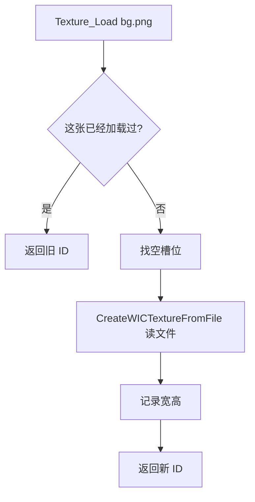


**注意：** `L"bg.png"` 是宽字符串，png 要放在 **exe 同目录**（或设置 VS 工作目录）。

### 7.3 绘制前绑定纹理 Texture_SetTexture

👉 打开代码：`textureManager.cpp` 第 112-122 行

```112:122:textureManager.cpp
void Texture_SetTexture(int texture_id)
{
	// ... 检查 id 合法 ...
	ID3D11ShaderResourceView* pSRV = g_Textures[texture_id].pTextureView;
	Direct3D_GetDeviceContext()->PSSetShaderResources(0, 1, &pSRV);
}
```

把纹理绑到像素着色器的 **t0** 寄存器 → 对应 HLSL 里的 `Texture2D major_texture : register(t0)`。

---

## 8. 着色器层：shader + hlsl

### 8.1 .hlsl 和 .cso 的关系

```
你写的源码          编译后              运行时读取
shader_vertex_2d.hlsl  →  shader_vertex_2d.cso  →  shader.cpp 加载
shader_pixel_2d.hlsl   →  shader_pixel_2d.cso   →  shader.cpp 加载
```

**改 .hlsl 后必须重新生成项目**，否则运行的还是旧 .cso。

### 8.2 顶点着色器 — 算位置

👉 打开代码：`shader_vertex_2d.hlsl` 第 11-45 行

```11:45:shader_vertex_2d.hlsl
cbuffer VS_CONSTANT_BUFFER : register(b0)
{
    float4x4 mtx;
};
cbuffer TestBuffer : register(b1)
{
    float2 position;
    float2 dummy;
}
// ...
VS_OUT main(VS_IN vs_in)
{
    VS_OUT vs_out;
    float4 pos = vs_in.posL;
    pos.xy += position;
    vs_out.posH = mul(pos, mtx);
    vs_out.color = vs_in.color;
    vs_out.ux = vs_in.ux;
    return vs_out;
}
```


| 寄存器    | C++ 谁设置              | 传什么          |
| ------ | -------------------- | ------------ |
| **b0** | `Shader_SetMatrix()` | 缩放×投影矩阵      |
| **b1** | `g_pTestBuffer`      | 精灵屏幕位置 (x,y) |


CPU 设置 b0 的代码 👉 `shader.cpp` 第 167-182 行：

```167:182:shader.cpp
void Shader_SetMatrix(const DirectX::XMMATRIX& matrix)
{
    XMFLOAT4X4 transpose;
    XMStoreFloat4x4(&transpose, XMMatrixTranspose(matrix));
    g_pContext->UpdateSubresource(g_pVSConstantBuffer, 0, nullptr, &transpose, 0, 0);
}
```

### 8.3 像素着色器 — 算颜色

👉 打开代码：`shader_pixel_2d.hlsl` 第 13-16 行

```13:16:shader_pixel_2d.hlsl
float4 main(PS_IN ps_in) : SV_TARGET
{
    return major_texture.Sample(major_sampler, ps_in.uv) * ps_in.color;
}
```

**翻译：** 最终像素色 = 纹理颜色 × 顶点颜色（含透明度）

### 8.4 InputLayout — 顶点格式说明书

👉 打开代码：`shader.cpp` 第 79-83 行

```79:83:shader.cpp
    D3D11_INPUT_ELEMENT_DESC layout[] = {
        {"POSITION", 0, DXGI_FORMAT_R32G32B32_FLOAT,0, D3D11_APPEND_ALIGNED_ELEMENT,D3D11_INPUT_PER_VERTEX_DATA, 0 },
        {"COLOR",0,DXGI_FORMAT_R32G32B32A32_FLOAT,0,D3D11_APPEND_ALIGNED_ELEMENT,D3D11_INPUT_PER_VERTEX_DATA, 0 },
        {"TEXCOORD",0,DXGI_FORMAT_R32G32_FLOAT,0,D3D11_APPEND_ALIGNED_ELEMENT,D3D11_INPUT_PER_VERTEX_DATA, 0}
    };
```

必须和 `sprite.cpp` 里的 `struct Vertex` 一致 👉 第 20-25 行：

```20:25:sprite.cpp
struct Vertex
{
	XMFLOAT3 position;   // 3个float
	XMFLOAT4 color;      // 4个float
	XMFLOAT2 texooord;   // 2个float (UV)
};
```

### 8.5 Shader_Begin — 每次画之前调用

👉 打开代码：`shader.cpp` 第 185-207 行

绑定：顶点着色器、像素着色器、输入布局、矩阵常量缓冲(b0)。

---

## 9. 绘制层：sprite.cpp（核心）

### 9.1 一张图 = 4 个顶点

```
vert[0] 左上 ─── vert[1] 右上
   │    ╲           │
   │      ╲         │
vert[2] 左下 ─── vert[3] 右下
```

用 `TRIANGLE_STRIP` 画 2 个三角形组成矩形。

### 9.2 Sprite_Initialize 创建的资源

👉 打开代码：`sprite.cpp` 第 29-108 行


| 变量                     | 行号      | 作用                      |
| ---------------------- | ------- | ----------------------- |
| `g_pVertexBuffer`      | 51      | 存 4 个顶点                 |
| `g_pTestBuffer`        | 60      | 定数缓冲，传 position 给 VS b1 |
| `g_pSamplerState`      | 72-82   | 纹理采样（点采样、WRAP 循环）       |
| `g_pBlendState`        | 86-100  | 半透明混合                   |
| `g_pDepthStencilState` | 103-106 | 关闭深度测试（2D 用）            |


### 9.3 Sprite_Draw 有多个重载（由简到繁）

👉 打开声明：`sprite.h`

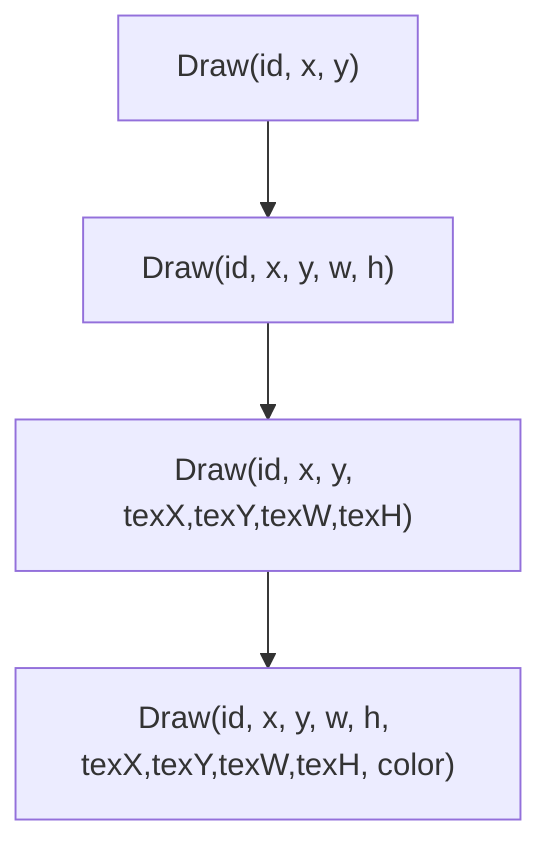


当前 `application.cpp` 用的是 **最完整版**（最后一档）。

### 9.4 简单画法：直接写屏幕坐标

👉 打开代码：`sprite.cpp` 第 138-183 行

关键步骤对照：


| 步骤  | 代码行     | 做什么                   |
| --- | ------- | --------------------- |
| 1   | 140     | `Shader_Begin()`      |
| 2   | 142-144 | 定数缓冲 position 设 (0,0) |
| 3   | 146     | 设置正交投影矩阵              |
| 4   | 148-151 | Map 顶点缓冲，拿到可写指针       |
| 5   | 153-166 | 写 4 个顶点的位置、颜色、UV      |
| 6   | 168     | Unmap                 |
| 7   | 172-174 | 告诉 GPU 顶点数据、拓扑类型      |
| 8   | 176-178 | 采样器 + 绑定纹理            |
| 9   | 180-182 | 混合 + 深度状态             |
| 10  | 183     | `Draw(4, 0)` 真正画！     |


### 9.5 完整画法：矩阵 + 切图（application 在用）

👉 打开代码：`sprite.cpp` 第 204-261 行

**和简单法的区别：**


| 项目   | 简单法 (138行) | 完整法 (204行)                       |
| ---- | ---------- | -------------------------------- |
| 顶点位置 | 直接写屏幕坐标    | 写 0~1 单位矩形                       |
| 位移   | 写在顶点里      | `g_pTestBuffer` + 着色器 `position` |
| 缩放   | 写在顶点宽高里    | 矩阵 `mtxS = Scaling(w,h)`         |
| 切图   | UV 0~1 整图  | 按像素算 u0,u1,tv0,tv1               |


矩阵计算 👉 第 213-219 行：

```213:219:sprite.cpp
	XMMATRIX mtxS = XMMatrixScaling(width, height, 1.0f);
	XMMATRIX mtxT = XMMatrixTranslation(position_x, position_y, 0.0f);
	XMMATRIX mtxP = XMMatrixOrthographicOffCenterLH(0.0f, SCREEN_WIDTH, SCREEN_HEIGHT, 0.0f, 0.0f, 1.0f);

	XMMATRIX mtx = mtxS * mtxP;

	Shader_SetMatrix(mtx);
```

UV 切图计算 👉 第 236-244 行：

```236:244:sprite.cpp
	float u0 = texture_x / (float)Texture_GetWidth(texture_id);
	float tv0 = texture_y / (float)Texture_GetHeight(texture_id);
	float u1 = (texture_x + texture_width) / (float)Texture_GetWidth(texture_id);
	float tv1 = (texture_y + texture_height) / (float)Texture_GetHeight(texture_id);

	vert[0].texooord = { u0, tv0 };
	vert[1].texooord = { u1, tv0 };
	vert[2].texooord = { u0, tv1 };
	vert[3].texooord = { u1, tv1 };
```

---

## 10. 一帧画面的完整数据流

**以「画 COCO 左上角那一帧」为例：**

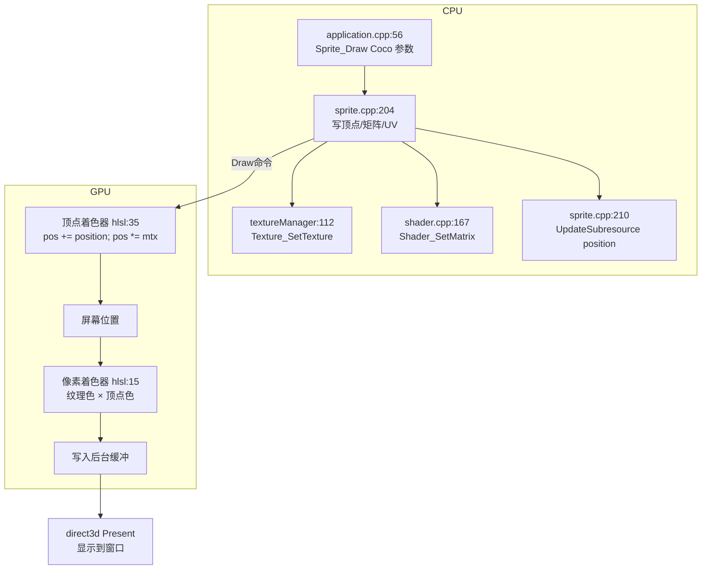


**数据清单（画一次 Sprite 传了什么）：**


| 数据                      | 从哪来                     | 到哪去    |
| ----------------------- | ----------------------- | ------ |
| 4 个顶点 position/color/UV | CPU Map 写入              | 顶点着色器  |
| 矩阵 mtx                  | `Shader_SetMatrix`      | VS b0  |
| 位置 position             | `g_pTestBuffer`         | VS b1  |
| 纹理图片                    | `Texture_SetTexture`    | PS t0  |
| 采样方式                    | `g_pSamplerState`       | PS s0  |
| 混合/深度                   | BlendState / DepthState | 输出合并阶段 |


---

## 11. 当前 application 里三行画图的参数拆解

### 11.1 第一行：滚动背景

👉 `application.cpp` 第 56 行

```cpp
Sprite_Draw(g_TextureId_bg,
    0.0f, 0.0f,                          // 屏幕左上角
    (float)SCREEN_WIDTH, (float)SCREEN_HEIGHT,  // 铺满 1600x900
    (int)g_TextureScrollX, 0,            // 从图集 x=滚动量 开始切
    SCREEN_WIDTH,                          // 横向切 1600 像素宽（会 WRAP 循环）
    (int)Texture_GetHeight(g_TextureId_bg)); // 竖向用整张图高
```


### 11.2 第二行：左上角 COCO 第 1 帧

👉 `application.cpp` 第 57 行

```cpp
Sprite_Draw(g_TextureId_Coco,
    0.0f, 0.0f,      // 屏幕位置 (0,0)
    64.0f, 64.0f,    // 屏幕显示 64x64
    0, 0,            // 从图集 (0,0) 开始
    32, 32);         // 切 32x32（coco 一格是 32 像素）
```

= 切图集第一格，放大 2 倍显示。

### 11.3 第三行：带颜色半透明 COCO

👉 `application.cpp` 第 58 行

```cpp
Sprite_Draw(..., 500, 520, 128, 128, 0, 0, 32, 32,
    XMFLOAT4(0.0f, 0.5f, 0.7f, 0.8f));
//         R     G     B     A(透明度)
```

颜色在像素着色器里：`纹理色 × (0, 0.5, 0.7, 0.8)`。

---

## 12. C# 程序员必看的 C++ 差异


| 概念   | C#               | 本项目示例                      |
| ---- | ---------------- | -------------------------- |
| 入口   | `Main()`         | `WinMain()`                |
| 空    | `null`           | `nullptr`                  |
| 释放资源 | GC / `Dispose()` | `SAFE_RELEASE(ptr)`        |
| 指针   | 引用类型             | `ID3D11Device*`            |
| 头文件  | 无                | `.h` 声明 + `.cpp` 实现        |
| 全局变量 | `static` 字段      | `static int g_xxx`         |
| 字符串  | `"text"`         | `L"text"`（宽字符，Windows API） |
| 默认参数 | 方法参数默认值          | 用重载函数代替（见 sprite.h）        |


**SAFE_RELEASE 宏** 👉 `direct3d.h` 第 8 行：

```8:8:direct3d.h
#define SAFE_RELEASE(o) do { if (o) { (o)->Release(); (o) = NULL; } } while(0)
```

---

## 13. 名词表


| 名词              | 一句话解释       | 在本项目哪里                              |
| --------------- | ----------- | ----------------------------------- |
| HWND            | 窗口 ID       | `main.cpp` CreateWindow 返回值         |
| Device          | 显卡资源工厂      | `direct3d.cpp` g_pDevice            |
| DeviceContext   | 执行绘制命令      | `Direct3D_GetDeviceContext()`       |
| SwapChain       | 双缓冲         | `direct3d.cpp` Present              |
| Vertex Buffer   | 顶点数据        | `sprite.cpp` g_pVertexBuffer        |
| Constant Buffer | CPU→GPU 小数据 | g_pTestBuffer / g_pVSConstantBuffer |
| UV              | 纹理坐标 0~1    | `struct Vertex` 的 texooord          |
| Sprite          | 2D 图片       | `Sprite_Draw`                       |
| Shader          | GPU 小程序     | `.hlsl` / `.cso`                    |
| Blend           | 透明混合        | `sprite.cpp` g_pBlendState          |
| WRAP            | 纹理循环平铺      | 背景滚动用                               |


---

## 14. 建议学习顺序（带代码作业）

### 第 1 步：跟流程（1 天）

1. 读 `main.cpp` 97-116 行，理解消息循环
2. 读 `application.cpp` 全文（只有 64 行）
3. **作业：** 把 `g_TextureScrollX += 2` 改成 `5`，看背景变快

### 第 2 步：改显示（1-2 天）

1. 读 `application.cpp` 57-58 行三个 `Sprite_Draw`
2. **作业：** 改 COCO 的屏幕坐标，看角色移动
3. **作业：** 改 `texture_x` 为 `32` 看第 2 帧

### 第 3 步：理解 Sprite_Draw（3-5 天）

1. 读 `sprite.cpp` 138-183 行（简单版）
2. 读 `sprite.cpp` 204-261 行（完整版）
3. 对照 `shader_vertex_2d.hlsl` 和 `shader_pixel_2d.hlsl`
4. **作业：** 改像素着色器，让画面变红（`* float4(1,0,0,1)`）

### 第 4 步：理解纹理（2 天）

1. 读 `textureManager.cpp` Texture_Load / Texture_SetTexture
2. **作业：** 换一张 png 文件名，看加载是否成功

### 第 5 步：理解 Direct3D（3 天）

1. 读 `direct3d.cpp` DrawBegin / Present
2. 理解双缓冲概念

---

## 附录：常见问题


| 问题        | 去哪看                                   |
| --------- | ------------------------------------- |
| 图片不显示     | png 是否在 exe 目录；`Texture_Load` 是否返回 -1 |
| 改 hlsl 无效 | 是否重新生成项目（.cso 要更新）                    |
| 编译 C4819  | 源文件存 UTF-8 with BOM 或注释用英文            |
| 右边有蓝边     | `SCREEN_WIDTH=1600` 但窗口更宽，需统一尺寸       |


---

*文档版本：已删除 polygon，对应当前 Project2 代码。*