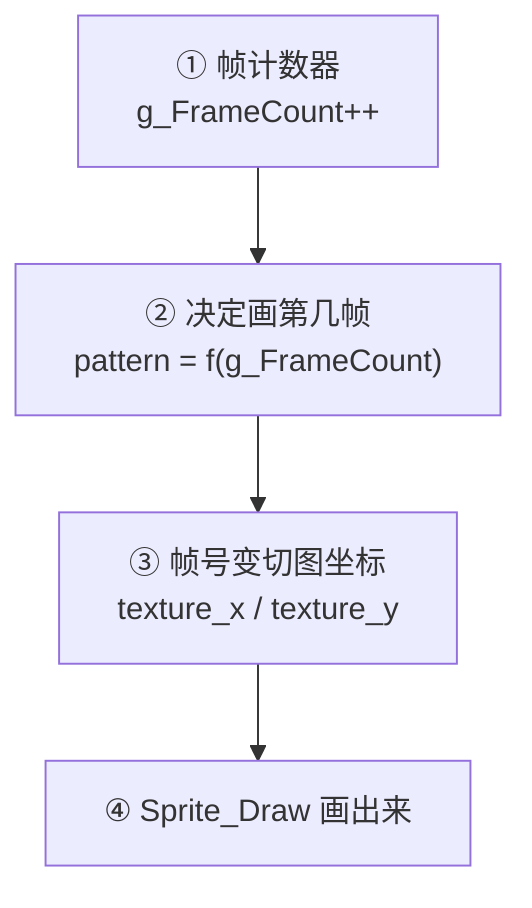
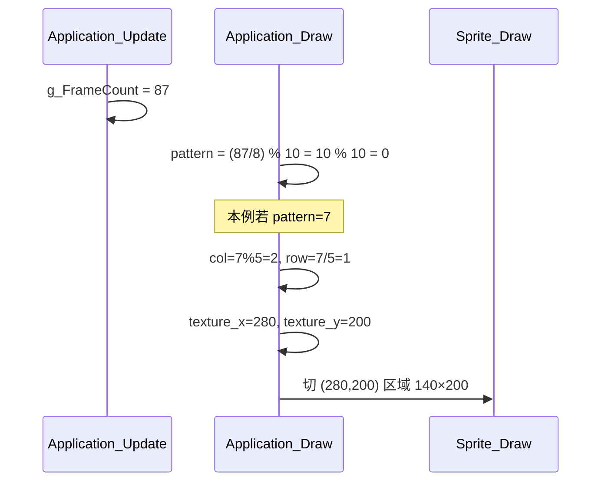
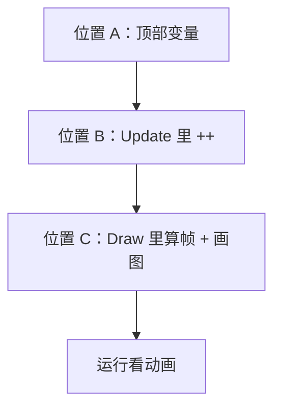

# 项目学习指南 2：纹理动画（テクスチャアニメーション）

> 面向：**0 基础**（请先读完《项目学习指南.md》里的 UV 切图、`Sprite_Draw`、游戏循环）  
> 来源：课程 PDF《テクスチャアニメーション》  
> 目标：**让你的 `Character.png` 像翻页动画一样动起来**

---

## 目录

- [0. 你要实现什么](#0-你要实现什么)
- [**👉 带着你做（先看这里）**](#17-带着你做逐步改-applicationcpp必做)
- [1. 先复习：上一课已经会了什么](#1-先复习上一课已经会了什么)
- [2. 纹理动画是什么](#2-纹理动画是什么)
- [3. 你的 Character.png 长什么样（已确认）](#3-你的-characterpng-长什么样已确认)
- [4. 精灵图（Sprite Sheet）的两种摆法](#4-精灵图sprite-sheet的两种摆法)
- [5. 实现的四步逻辑](#5-实现的四步逻辑)
- [6. 第一步：帧计数器 g_FrameCount](#6-第一步帧计数器-g_framecount)
- [7. 第二步：算出「当前画第几帧」](#7-第二步算出当前画第几帧)
- [8. 第三步：帧号 → 切图像素坐标](#8-第三步帧号--切图像素坐标)
- [9. 第四步：调用 Sprite_Draw](#9-第四步调用-sprite_draw)
- [10. 主角示例：Character 跑步动画（2×5 网格）](#10-主角示例character-跑步动画25-网格)
- [11. 动画太快怎么办](#11-动画太快怎么办)
- [12. 参考：横一排 Coco / 硬币网格](#12-参考横一排-coco--硬币网格)
- [13. 采样滤镜 Sprite_SetFilter](#13-采样滤镜-sprite_setfilter)
- [14. 素材文件夹 asset 整理](#14-素材文件夹-asset-整理)
- [15. 隐藏问题：显示器 Hz 不同速度不同](#15-隐藏问题显示器-hz-不同速度不同)
- [16. 对照你现在的 application.cpp](#16-对照你现在的-applicationcpp)
- [17. 【带着你做】逐步改 application.cpp（必做）](#17-带着你做逐步改-applicationcpp必做)
- [18. 对照表：你现在的进度](#18-对照表你现在的进度)
- [19. 名词表](#19-名词表)

---

## 0. 你要实现什么

**现在：** `Character.png` 只切 **左上角第一格** 画在屏幕上（静止的）。

```67:67:application.cpp
	Sprite_Draw(g_TextureId_Character, 500.0f, 620.0f, 128.0f, 128.0f, 0, 0, 123, 190, DirectX::XMFLOAT4(1.0f, 0.0f, 0.0f, 1.0f));
```

这里有两个问题：

1. `texture_x=0, texture_y=0` 永远不变 → **永远是第 0 帧**
2. 切图大小 `123×190` **和图集真实格子不一致**（你的图每格是 **140×200**，见第 3 节）

**做完本课后：** 每帧根据 `pattern` 算出不同的 `texture_x` 和 `texture_y` → 跑步循环动画。


这和 Unity 里 **Sprite Animation / 逐帧换 Sprite** 是同一思路。

---

## 1. 先复习：上一课已经会了什么

纹理动画 **不需要新写一个画图函数**，继续用带切图参数的 `Sprite_Draw`：

```45:52:sprite.h
void Sprite_Draw(
	int texture_id,
	float position_x, float position_y,
	float width, float height,
	int texture_x, int texture_y,
	int texture_width, int texture_height,
	const DirectX::XMFLOAT4& color
);
```

👉 打开 `sprite.cpp` 第 207 行：这个函数负责

1. 从图集 `(texture_x, texture_y)` 切 `texture_width × texture_height`
2. 画到屏幕 `(position_x, position_y)`，显示成 `width × height`

**上一课（UV 切图）= 工具**  
**这一课（纹理动画）= 每帧换切图坐标**

---

## 2. 纹理动画是什么

### 2.1 人话解释

把一本 **小人走路的翻页动画书**：

- 第 1 页：左脚在前  
- 第 2 页：双脚并拢  
- 第 3 页：右脚在前  
- …

快速翻页 → 眼睛觉得「在走路」。

游戏里不真的翻很多张 png 文件，而是 **一张大图（精灵图 / Sprite Sheet）** 里横着或竖着摆好所有姿势，程序 **每帧只「抠」其中一格来画**。

### 2.2 专业名词

| 日文/英文 | 中文 | 含义 |
|-----------|------|------|
| フリップブック / Flipbook | 翻页动画 | 快速换图造成动感 |
| スプライトアニメーション | 精灵动画 | 同上，游戏开发常用说法 |
| スプライトシート | 精灵图 / 图集 | 多帧姿势在一张 png 里 |
| パターン / Pattern | 帧 / 格 | 图集中的一小格 |
| UV 切り取り | UV 切图 | 从大图裁一块来画 |

### 2.3 和 Unity 对比

| Unity | 本项目 |
|-------|--------|
| Sprite Sheet + Animator | `Character.png` + `g_FrameCount` 算帧号 |
| `sprite.frame` 换帧 | 改 `Sprite_Draw` 的 `texture_x` / `texture_y` |
| `Animation Clip` 速度 | `(g_FrameCount / N)` 控制 |

---

## 3. 你的 Character.png 长什么样（已确认）

根据你提供的 `Character.png`：

### 3.1 图集总览

| 项目 | 数值 | 怎么来的 |
|------|------|----------|
| 整张图尺寸 | **700 × 400** 像素 | 读 png 文件头 |
| 排列方式 | **2 行 × 5 列** | 看图数格子 |
| 总帧数 | **10** | 2×5 |
| 每格宽 | **140** | 700 ÷ 5 |
| 每格高 | **200** | 400 ÷ 2 |

### 3.2 帧编号图（从 0 开始数）

```
        列0    列1    列2    列3    列4
        x=0   x=140  x=280  x=420  x=560
行0 y=0  [0]   [1]   [2]   [3]   [4]
行1 y=200 [5]   [6]   [7]   [8]   [9]
```

读法：**先横着扫完第一行，再从第二行左边开始**（和 PDF 硬币网格一样）。

### 3.3 你之前代码里 123×190 为什么不对

| 你写的 | 实际每格 | 后果 |
|--------|----------|------|
| 宽 123 | 140 | 切到相邻帧的一部分，画面会「挤」「裁错」 |
| 高 190 | 200 | 第二行 Y 起点应是 200，不是 190 的倍数 |

**本课请统一改成：宽 140、高 200、横 5 列。**

### 3.4 重要：你的图是「网格」，不是「横一排」

- Coco 课件：13 帧横 1 行 → 只改 `texture_x`，`texture_y` 永远是 0  
- **你的 Character：10 帧 2 行 5 列 → `texture_x` 和 `texture_y` 都要算**

---

## 4. 精灵图（Sprite Sheet）的两种摆法

PDF 里两种常见摆法：

### 4.1 横一排（Coco 课件用）

```
[帧0][帧1][帧2][帧3] ... [帧12]
```

- 切图 Y 永远是 `0`  
- 切图 X = `帧号 × 每帧宽度`

Coco 例子：13 帧，每格 32×32，一整行。

### 4.2 横竖网格（你的 Character / 硬币）

```
[0][1][2][3][4]
[5][6][7][8][9]
```

- 列号 = `pattern % 5`  
- 行号 = `pattern / 5`  
- 切图 X = `列号 × 140`  
- 切图 Y = `行号 × 200`

### 4.3 你的 Character 属于哪一种？

**→ 4.2 横竖网格**，不是 Coco 横一排。

---

## 5. 实现的四步逻辑

PDF 总结的核心流程（**全部在 `application.cpp` 完成**，`sprite.cpp` 不用改算法）：



| 步骤 | 在哪里做 | 干什么 |
|------|----------|--------|
| ① | `Application_Update` | 每帧 +1，记录「游戏跑了几帧」 |
| ② | `Application_Draw` | 用 `%` 和 `/` 算出当前 pattern |
| ③ | `Application_Draw` | pattern → 像素坐标 |
| ④ | `Application_Draw` | 传给 `Sprite_Draw` |

---

## 6. 第一步：帧计数器 g_FrameCount

### 6.1 是什么

一个 **全局 int 变量**，游戏每更新一帧就 `+1`。

类似 Unity 里「从开局到现在过了多少帧」——不是秒，是 **Update 调用次数**。

### 6.2 加在哪里

👉 `application.cpp` 文件顶部，和其他 `g_` 变量放一起：

```cpp
static int g_FrameCount = 0;   // [新增] 帧计数器
```

你已有：

```8:13:application.cpp
static int g_TextureId_bg{ TEXTURE_INVALID_ID };
static int g_TextureId_1{ TEXTURE_INVALID_ID };
static int g_TextureId_2{ TEXTURE_INVALID_ID };
static int g_TextureId_Character{ TEXTURE_INVALID_ID };
static float g_TextureScrollX{ 0.0f };
```

在 `g_TextureScrollX` 下面加 `g_FrameCount` 即可。

### 6.3 什么时候增加

👉 `Application_Update` 里，**每帧一次**：

```52:56:application.cpp
void Application_Update()
{
	g_TextureScrollX += -3.0f;

}
```

改成（保留你的滚动，多加一行）：

```cpp
void Application_Update()
{
	g_TextureScrollX += -3.0f;
	g_FrameCount++;   // [新增] 每帧 +1
}
```

### 6.4 为什么放 Update 不放 Draw

| 函数 | 职责 |
|------|------|
| `Update` | 改数据、算逻辑 |
| `Draw` | 只根据当前数据画 |

帧计数是 **逻辑状态** → 放 `Update`。  
和 C# 里在 `Update()` 里累加计时一样，不要在 `OnRender` 里改游戏状态。

---

## 7. 第二步：算出「当前画第几帧」

### 7.1 Character 用的公式

```cpp
static constexpr int CHARACTER_PATTERN_MAX = 10;  // 你的图：2行×5列=10帧

int pattern = g_FrameCount % CHARACTER_PATTERN_MAX;           // 先不减速
// int pattern = (g_FrameCount / 10) % CHARACTER_PATTERN_MAX;  // 减速版
```

`pattern` 范围 **0～9**，到 10 自动回到 0。

### 7.2 `%`（取余）是什么

**除法的余数**，C# 里也是 `%`：

| 表达式 | 结果 |
|--------|------|
| `7 % 5` | 2（第 2 列） |
| `10 % 10` | 0（回到第 0 帧） |

### 7.3 代码写法

在 `Application_Draw` 里，**画 Character 之前**：

```cpp
static constexpr int CHARACTER_PATTERN_MAX = 10;
int pattern = (g_FrameCount / 10) % CHARACTER_PATTERN_MAX;
```

`static constexpr` = 编译期常量，改配置只改这一处。

---

## 8. 第三步：帧号 → 切图像素坐标

### 8.1 Character 专用（2 行 5 列）—— 本课重点

```cpp
static constexpr int CHARACTER_COLUMN_MAX = 5;   // 横着 5 列
static constexpr int CHARACTER_W = 140;        // 每格宽
static constexpr int CHARACTER_H = 200;        // 每格高

int col = pattern % CHARACTER_COLUMN_MAX;      // 第几列 → 决定 X
int row = pattern / CHARACTER_COLUMN_MAX;      // 第几行 → 决定 Y

int texture_x = col * CHARACTER_W;
int texture_y = row * CHARACTER_H;
```

### 8.2 逐帧对照表（查表用）

| pattern | 列 | 行 | texture_x | texture_y |
|---------|----|----|-----------|-----------|
| 0 | 0 | 0 | 0 | 0 |
| 1 | 1 | 0 | 140 | 0 |
| 2 | 2 | 0 | 280 | 0 |
| 3 | 3 | 0 | 420 | 0 |
| 4 | 4 | 0 | 560 | 0 |
| 5 | 0 | 1 | 0 | 200 |
| 6 | 1 | 1 | 140 | 200 |
| 7 | 2 | 1 | 280 | 200 |
| 8 | 3 | 1 | 420 | 200 |
| 9 | 4 | 1 | 560 | 200 |

### 8.3 横一排（Coco 课件用，Character 不用）

```
切图 X = pattern × PATTERN_W
切图 Y = 0
```

### 8.4 通用网格公式（和硬币相同）

```
列 = pattern % COLUMN_MAX
行 = pattern / COLUMN_MAX        // 整数除法

切图 X = 列 × PATTERN_W
切图 Y = 行 × PATTERN_H
```

**例（pattern = 7，你的 Character）：**

| 计算 | 结果 |
|------|------|
| `7 % 5` | 2 → 第 2 列 |
| `7 / 5` | 1 → 第 1 行 |
| `texture_x` | 2 × 140 = **280** |
| `texture_y` | 1 × 200 = **200** |

### 8.5 图解 pattern=7

```
列:  0    1    2    3    4
行0 [0]  [1]  [2]  [3]  [4]
行1 [5]  [6] [7]←  [8]  [9]
行2 ...
```

`7` 在第 1 行、第 2 列 → X=2×宽，Y=1×高。

---

## 9. 第四步：调用 Sprite_Draw

```cpp
Sprite_Draw(
    g_TextureId_Character,
    500.0f, 620.0f,                  // 屏幕位置
    128.0f, 128.0f,                  // 屏幕显示多大（可改）
    texture_x, texture_y,            // 切图起点（每帧变）
    CHARACTER_W, CHARACTER_H,        // 切图大小 140×200
    DirectX::XMFLOAT4(1.0f, 1.0f, 1.0f, 1.0f)  // 原色；红 tint 会整人变红
);
```

**动画的本质：** `texture_x`、`texture_y` 每帧在变，其它可固定。

---

## 10. 主角示例：Character 跑步动画（2×5 网格）

### 10.1 完整代码（直接可抄进 Application_Draw）

```cpp
// --- Character 跑步：700×400 图集，2行5列，每格 140×200 ---
static constexpr int CHARACTER_PATTERN_MAX   = 10;
static constexpr int CHARACTER_COLUMN_MAX  = 5;
static constexpr int CHARACTER_W           = 140;
static constexpr int CHARACTER_H           = 200;
static constexpr int CHARACTER_ANIM_SLOW   = 8;   // 越大越慢，自己调

int pattern = (g_FrameCount / CHARACTER_ANIM_SLOW) % CHARACTER_PATTERN_MAX;

int col = pattern % CHARACTER_COLUMN_MAX;
int row = pattern / CHARACTER_COLUMN_MAX;

Sprite_Draw(g_TextureId_Character,
    500.0f, 620.0f,
    128.0f, 128.0f,
    col * CHARACTER_W,
    row * CHARACTER_H,
    CHARACTER_W, CHARACTER_H,
    DirectX::XMFLOAT4(1.0f, 1.0f, 1.0f, 1.0f));
```

### 10.2 和 PDF 硬币公式的关系

| | 硬币（课件） | 你的 Character |
|--|-------------|----------------|
| 总帧数 | 20 | **10** |
| 列数 | 5 | **5** |
| 每格大小 | 400×400 | **140×200** |
| 公式 | 完全相同 | 完全相同 |

Character **不是** Coco 那种「只改 X」；**是** 硬币那种「`%` 算列、`/` 算行」。

### 10.3 数据流（pattern = 7 时）



---

## 11. 动画太快怎么办

### 11.1 为什么会飞快

游戏循环 **没有 Windows 消息时就在狂跑**：

```113:116:main.cpp
		else { 
			Application_Update();
			Application_Draw();
		}
```

一秒可能跑 **60、144 甚至几百次** `Update` → `g_FrameCount` 一秒 +60、+144…  
若 `pattern = g_FrameCount % 13`，**每秒换 60 张图** → 动画快到看不清。

### 11.2 解决办法：整数除法放慢

```cpp
// 太快：
int pattern = g_FrameCount % 10;

// 放慢：每 8 帧才进下一格（Character 跑步建议 6～12 之间试）
int pattern = (g_FrameCount / 8) % 10;
```

### 11.3 为什么 `/ 8` 能变慢

C++ **整数除法**小数直接丢掉：

| g_FrameCount | g_FrameCount / 8 | pattern（%10） |
|--------------|-------------------|----------------|
| 0～7 | 0 | 0 |
| 8～15 | 1 | 1 |
| 16～23 | 2 | 2 |

### 11.4 调参建议

| 除数 N | 效果 |
|--------|------|
| 越小（如 5） | 越快 |
| 越大（如 15） | 越慢 |

跑步 10 格动画常用 **6～12** 试手感。

---

## 12. 参考：横一排 Coco / 硬币网格

### 12.1 Coco（横 1 行 13 帧，课件用）

```cpp
static constexpr int COCO_WALK_ANIM_PATTERN_MAX = 13;
static constexpr int COCO_W = 32;
static constexpr int COCO_H = 32;

int pattern = (g_FrameCount / 10) % COCO_WALK_ANIM_PATTERN_MAX;

Sprite_Draw(g_TextureCoco, 200.0f, 200.0f, 256.0f, 256.0f,
    pattern * COCO_W, 0, COCO_W, COCO_H);
```

### 12.2 硬币（横 5 列 4 行 20 帧，和 Character 同一套公式）

```cpp
static constexpr int COIN_ANIM_PATTERN_MAX        = 20;
static constexpr int COIN_ANIM_PATTERN_COLUMN_MAX   = 5;
static constexpr int COIN_PATTERN_SIZE_WIDTH      = 400;
static constexpr int COIN_PATTERN_SIZE_HEIGHT     = 400;

int coin_anim_pattern = (g_FrameCount / 5) % COIN_ANIM_PATTERN_MAX;

Sprite_Draw(g_TextureCoinAnim,
    500.0f, 200.0f,
    256.0f, 256.0f,
    (coin_anim_pattern % COIN_ANIM_PATTERN_COLUMN_MAX) * COIN_PATTERN_SIZE_WIDTH,
    (coin_anim_pattern / COIN_ANIM_PATTERN_COLUMN_MAX) * COIN_PATTERN_SIZE_HEIGHT,
    COIN_PATTERN_SIZE_WIDTH,
    COIN_PATTERN_SIZE_HEIGHT);
```

注意 `%` 和 `/` **作用不同**：

| 运算符 | 得到什么 |
|--------|----------|
| `% COLUMN_MAX` | 横着第几列 → **X** |
| `/ COLUMN_MAX` | 第几行 → **Y** |

---

## 13. 采样滤镜 Sprite_SetFilter

### 13.1 为什么要学这个

现在 `sprite.cpp` 里 **写死了一种采样**：

```73:74:sprite.cpp
	sampler_desc.Filter = D3D11_FILTER_MIN_MAG_MIP_POINT;
```

| 滤镜 | 效果 | 适合 |
|------|------|------|
| **POINT**（点采样） | 放大缩小都锐利、有像素块 | 点阵 / ドット絵 Character |
| **LINEAR**（线性） | 放大时平滑 | 硬币、UI、插画 |

Character 是 3D 渲染风剪影，用默认 **POINT** 即可；若以后加硬币再学 `Sprite_SetFilter`。

### 13.2 要加什么（按 PDF 做）

**① `sprite.h` 增加：**

```cpp
enum Sprite_Filter
{
	Sprite_Filter_Point,   // 点阵用
	Sprite_Filter_Linear,  // 插画用
};

void Sprite_SetFilter(Sprite_Filter filter);
```

**② `sprite.cpp` 初始化时创建两个采样器：**

```cpp
static ID3D11SamplerState* g_pSamplerState_Point  = nullptr;
static ID3D11SamplerState* g_pSamplerState_Linear = nullptr;

// POINT: D3D11_FILTER_MIN_MAG_MIP_POINT, Address = CLAMP
// LINEAR: D3D11_FILTER_MIN_MAG_MIP_LINEAR, Address = CLAMP
```

**③ `Sprite_SetFilter` 里 `PSSetSamplers(0, 1, &对应采样器)`**

**④ 重要：从两个 `Sprite_Draw` 里删掉这行（否则会被覆盖）：**

```cpp
// 删除：
Direct3D_GetDeviceContext()->PSSetSamplers(0, 1, &g_pSamplerState);
```

👉 你项目里这行还在 `sprite.cpp` 约 178、257 行，做 `Sprite_SetFilter` 时必须删。

**⑤ 画之前切换：**

```cpp
Sprite_SetFilter(Sprite_Filter_Point);    // Character 前
Sprite_Draw(...Character...);

Sprite_SetFilter(Sprite_Filter_Linear);   // 硬币前（若你有 coin 图）
Sprite_Draw(...Coin...);
```

### 13.3 原理一句话

采样器告诉 GPU：**从贴图上取色时，是「选最近一个像素」还是「周围像素混合」**。  
`Sprite_SetFilter` = 画不同素材前换采样方式。

---

## 14. 素材文件夹 asset 整理

PDF 建议项目变大后这样整理：

```
Project2/
├── asset/
│   ├── texture/     ← 所有 png
│   └── shader/      ← 编译后的 .cso
├── shader_vertex_2d.hlsl   ← 源码仍放项目根或单独目录
└── ...
```

### 14.1 构建后自动复制 cso

Visual Studio → 项目属性 → **生成事件 → 后期生成事件**：

```bat
xcopy /D /Y "$(TargetDir)*.cso" "$(ProjectDir)asset\shader"
```

### 14.2 改加载路径

**shader.cpp：**

```cpp
std::ifstream ifs_vs("asset/shader/shader_vertex_2d.cso", std::ios::binary);
std::ifstream ifs_ps("asset/shader/shader_pixel_2d.cso", std::ios::binary);
```

**application.cpp：**

```cpp
g_TextureId_Character = Texture_Load(L"asset/texture/Character.png");
```

### 14.3 为什么要整理

| 问题 | 整理后 |
|------|--------|
| png、cso 散落项目根目录 | 一眼分清代码和资源 |
| 改路径后找不到文件 | 路径统一、少踩坑 |

**注意：** 改路径后 png / cso 必须真的在对应文件夹，且 **VS 工作目录** 一般是项目根目录。

---

## 15. 隐藏问题：显示器 Hz 不同速度不同

### 15.1 问题

```cpp
int pattern = (g_FrameCount / 10) % PATTERN_MAX;
```

速度绑在 **「多少帧换一格」** 上，而 **每秒多少帧** 取决于：

- CPU 快慢  
- 是否开垂直同步 `Present(1,0)`  
- 显示器 60Hz / 144Hz / 240Hz  

→ **144Hz 显示器上动画比 60Hz 快 2.4 倍**（PDF 说的「商业游戏致命 bug」种子）。

### 15.2 正确方向（以后学）

不用 `g_FrameCount`，改用 **真实时间（毫秒）**：

```cpp
// 未来会学，现在知道即可：
// elapsed_ms = 现在时间 - 上一帧时间
// pattern = (elapsed_ms / 每帧间隔ms) % PATTERN_MAX
```

这叫 **Delta Time / 固定时间步**，Unity 的 `Time.deltaTime` 同一类思想。

### 15.3 现在怎么办

课程阶段用 `(g_FrameCount / N)` **足够**；调 `N` 在你自己电脑上试到顺眼即可。

---

## 16. 对照你现在的 application.cpp

| 项目 | 你现在的状态 | 本课要改的 |
|------|--------------|------------|
| 贴图 | `Character.png` 700×400 ✓ | — |
| 排列 | 2×5 网格 | 用 `%5` 和 `/5` |
| 切图大小 | **错** 123×190 | 改成 **140×200** |
| 切图起点 | 固定 (0,0) | 每帧算 col/row |
| 帧计数 | **已有** `g_FrameCount` ✓ | 见第 17 步 |
| 动画公式 | **还没写** | 替换第 70～72 行 |
| 颜色 | 红色 tint | 建议改成 `(1,1,1,1)` |

> **新手请直接跳到 [第 17 节](#17-带着你做逐步改-applicationcpp必做)**，按步骤改 `application.cpp` 即可。

---

## 17. 【带着你做】逐步改 application.cpp（必做）

本课 **只改一个文件**：`application.cpp`  
**不用改** `sprite.cpp`、`shader.cpp`（它们已经有切图版 `Sprite_Draw` 了）。

### 17.0 打开文件，先看结构

在 VS 里打开：`application.cpp`

这个文件一共 **4 个函数**，动画相关只动 **3 个地方**：

```
application.cpp
│
├── 第 8～14 行   ← 【位置 A】全局变量区（g_FrameCount 等）
│
├── Application_Initialize()   ← 加载 Character.png，一般不用动
├── Application_Finalize()     ← 不用动
│
├── Application_Update()         ← 【位置 B】每帧 g_FrameCount++
│
└── Application_Draw()           ← 【位置 C】算 pattern + Sprite_Draw 画角色
```



---

### 17.1 确认素材（改代码前）

**文件：** 把 `Character.png` 放在 **exe 同目录**

通常是：`Project2\x64\Debug\Character.png`

和 `bg.png` 放一起。路径不对会弹「纹理加载失败」。

**不用写代码**，复制文件即可。

---

### 17.2 位置 A：顶部加 `g_FrameCount`

**文件：** `application.cpp`  
**在哪：** 第 8 行附近，所有 `static` 变量那一块  
**干什么：** 声明帧计数器

**你应该看到类似这样（你可能已经写好了）：**

```cpp
// texture ids
static int g_FrameCount = 0;                              // ← 要有这一行
static int g_TextureId_bg{ TEXTURE_INVALID_ID };
static int g_TextureId_1{ TEXTURE_INVALID_ID };
static int g_TextureId_2{ TEXTURE_INVALID_ID };
static int g_TextureId_Character{ TEXTURE_INVALID_ID };
static float g_TextureScrollX{ 0.0f };
```

| 检查项 | 对了吗 |
|--------|--------|
| `g_FrameCount` 在 `g_TextureId_bg` **上面或附近** | ✓ |
| 拼写完全一致 `g_FrameCount` | ✓ |

**✅ 你当前第 9 行已有，可跳过。**

---

### 17.3 位置 B：`Application_Update` 里每帧 +1

**文件：** `application.cpp`  
**在哪：** `void Application_Update()` 函数 **内部**  
**干什么：** 每帧让计数器 +1

**找到这个函数（约第 53 行）：**

```cpp
void Application_Update()
{
	g_FrameCount++;              // ← 要有这一行（新增）
	g_TextureScrollX += -3.0f;   // ← 你原有的背景滚动，保留不动
}
```

**注意：**

- 写在 `Application_Update` 的 `{` 和 `}` **之间**
- **不要**写在 `Application_Draw` 里
- **不要**删 `g_TextureScrollX` 那行

**✅ 你当前第 55 行已有，可跳过。**

**运行一下：** 还没动画是正常的，计数器在涨但 Draw 还没用。

---

### 17.4 位置 C：`Application_Draw` —— 核心（你要改的主要部分）

**文件：** `application.cpp`  
**在哪：** `void Application_Draw()` 函数内部  
**顺序：** 先画背景 → **再画 Character 动画** → 最后 `Present`

#### 第 C-1 步：找到「插入点」

打开 `Application_Draw`，找到 **画完背景之后、Present 之前**：

```cpp
void Application_Draw()
{
	Direct3D_DrawBegin();

	// ① 背景（这行不要动）
	Sprite_Draw(g_TextureId_bg, 0.0f, 0.0f, ...);

	// ② 【在这里写 Character 动画】← 替换你现在第 70～72 行
	//    删掉旧的静止 Sprite_Draw，换成下面整段

	// ③ 显示（这行不要动）
	Direct3D_Present();
}
```

你现在的旧代码（**要删掉**）：

```cpp
	//Character动画 中间部分
	
	Sprite_Draw(g_TextureId_Character, 500.0f, 620.0f, 128.0f, 128.0f, 0, 0, 140, 200, ...);
```

问题：`0, 0` 是切图坐标 → **永远只画第 0 帧**。

---

#### 第 C-2 步：先粘贴「不减速」版（确认动画能跑）

**删除** 第 70～72 行旧内容，**替换为** 下面整段（原样复制）：

```cpp
	// --- Character 跑步动画（2行×5列，每格140×200）---
	static constexpr int CHARACTER_PATTERN_MAX  = 10;
	static constexpr int CHARACTER_COLUMN_MAX   = 5;
	static constexpr int CHARACTER_W = 140;
	static constexpr int CHARACTER_H = 200;

	int pattern = g_FrameCount % CHARACTER_PATTERN_MAX;
	int col = pattern % CHARACTER_COLUMN_MAX;
	int row = pattern / CHARACTER_COLUMN_MAX;

	Sprite_Draw(g_TextureId_Character,
		500.0f, 620.0f,
		128.0f, 128.0f,
		col * CHARACTER_W,
		row * CHARACTER_H,
		CHARACTER_W, CHARACTER_H,
		DirectX::XMFLOAT4(1.0f, 1.0f, 1.0f, 1.0f));
```

**这段代码每行干什么：**

| 行 | 写什么 | 写在哪儿 | 为什么 |
|----|--------|----------|--------|
| `static constexpr ...` | 10, 5, 140, 200 | Draw 里、Sprite_Draw **上面** | 你的图规格，集中配置 |
| `int pattern = ...` | 当前第几帧 0～9 | 紧接常量下面 | 用帧计数选姿势 |
| `int col / row` | 第几列、第几行 | pattern 下面 | 2×5 网格公式 |
| `Sprite_Draw(...)` | 画图 | col/row 下面 | 把算出的切图坐标传进去 |

**Sprite_Draw 参数对照（帮你对上学过的一课）：**

```cpp
Sprite_Draw(
    g_TextureId_Character,     // 贴图 id
    500.0f, 620.0f,            // 屏幕位置（可改）
    128.0f, 128.0f,            // 屏幕显示大小（可改）
    col * CHARACTER_W,         // texture_x ← 动画关键！每帧变
    row * CHARACTER_H,         // texture_y ← 第5帧后会变成 200
    CHARACTER_W, CHARACTER_H,  // 切图大小 140×200
    DirectX::XMFLOAT4(1,1,1,1) // 原色（不要红色 tint）
);
```

**▶ 保存 → 重新生成 → 运行**

**预期：** 角色 **飞快** 切换 10 个跑步姿势（像快进）。

- 若 **完全不动** → 检查 `g_FrameCount++` 有没有在 Update 里  
- 若 **切图错位/拉伸** → 检查是不是 140×200，不是 123×190  
- 若 **看不见人** → 检查 `Character.png` 是否在 exe 目录

---

#### 第 C-3 步：减速（动画太快再做）

**只改一行**，在 `Application_Draw` 里找到：

```cpp
	int pattern = g_FrameCount % CHARACTER_PATTERN_MAX;
```

**改成：**

```cpp
	int pattern = (g_FrameCount / 8) % CHARACTER_PATTERN_MAX;
```

| 数字 | 效果 |
|------|------|
| `/ 8` | 默认推荐，约每 8 次 Update 换一格 |
| `/ 5` | 更快 |
| `/ 12` | 更慢 |

**▶ 保存 → 运行 → 调到顺眼为止**

---

### 17.5 改完后的完整 `application.cpp` 参考

对照检查你有没有漏写、写错函数：

```cpp
#include <Windows.h>
#include "application.h"
#include "direct3d.h"
#include "shader.h"
#include "textureManager.h"
#include "sprite.h"

// texture ids
static int g_FrameCount = 0;                                    // 位置 A
static int g_TextureId_bg{ TEXTURE_INVALID_ID };
static int g_TextureId_1{ TEXTURE_INVALID_ID };
static int g_TextureId_2{ TEXTURE_INVALID_ID };
static int g_TextureId_Character{ TEXTURE_INVALID_ID };
static float g_TextureScrollX{ 0.0f };

bool Application_Initialize(HWND hWnd)
{
	if (!Direct3D_Initialize(hWnd)) return false;
	if (!Shader_Initialize(Direct3D_GetDevice(), Direct3D_GetDeviceContext())) return false;

	Texture_Initialize(Direct3D_GetDevice(), Direct3D_GetDeviceContext());
	g_TextureId_bg = Texture_Load(L"bg.png");
	g_TextureId_1 = Texture_Load(L"miku.png");
	g_TextureId_2 = Texture_Load(L"miku.png");
	g_TextureId_Character = Texture_Load(L"Character.png");     // 不用改

	if (!Sprite_Initialize()) return false;
	return true;
}

void Application_Finalize()
{
	Sprite_Finalize();
	Shader_Finalize();
	Direct3D_Finalize();
}

void Application_Update()
{
	g_FrameCount++;                  // 位置 B
	g_TextureScrollX += -3.0f;
}

void Application_Draw()
{
	Direct3D_DrawBegin();

	// 背景（不动）
	Sprite_Draw(g_TextureId_bg, 0.0f, 0.0f,
		(float)SCREEN_WIDTH, (float)SCREEN_HEIGHT,
		(int)g_TextureScrollX, 0,
		SCREEN_WIDTH, (int)Texture_GetHeight(g_TextureId_bg));

	// 位置 C：Character 动画
	static constexpr int CHARACTER_PATTERN_MAX  = 10;
	static constexpr int CHARACTER_COLUMN_MAX   = 5;
	static constexpr int CHARACTER_W = 140;
	static constexpr int CHARACTER_H = 200;

	int pattern = (g_FrameCount / 8) % CHARACTER_PATTERN_MAX;
	int col = pattern % CHARACTER_COLUMN_MAX;
	int row = pattern / CHARACTER_COLUMN_MAX;

	Sprite_Draw(g_TextureId_Character,
		500.0f, 620.0f,
		128.0f, 128.0f,
		col * CHARACTER_W,
		row * CHARACTER_H,
		CHARACTER_W, CHARACTER_H,
		DirectX::XMFLOAT4(1.0f, 1.0f, 1.0f, 1.0f));

	Direct3D_Present();
}
```

---

### 17.6 代码都写在哪个文件？（一览表）

| 本课内容 | 文件 | 函数/位置 | 你要做吗 |
|----------|------|-----------|----------|
| 帧计数变量 | `application.cpp` | 顶部 ~第 9 行 | ✅ 已有 |
| 每帧 +1 | `application.cpp` | `Application_Update` | ✅ 已有 |
| 算 pattern / col / row | `application.cpp` | `Application_Draw` 中部 | ⬜ **你要写** |
| 画 Character | `application.cpp` | `Application_Draw` 中部 | ⬜ **你要写** |
| 画背景 | `application.cpp` | `Application_Draw` 上部 | 已有，不动 |
| Present | `application.cpp` | `Application_Draw` 末尾 | 已有，不动 |
| 加载 png | `application.cpp` | `Application_Initialize` | 已有，不动 |
| Sprite_Draw 实现 | `sprite.cpp` | — | **不用动** |
| 着色器 | `shader.cpp` / `.hlsl` | — | **不用动** |
| Sprite_SetFilter | `sprite.cpp` | — | 可选，以后做 |
| asset 文件夹 | 多个文件 | — | 可选，以后做 |

---

### 17.7 带着做检查清单（打勾）

```
□ Character.png 在 x64\Debug\ 里
□ 位置 A：g_FrameCount 已声明
□ 位置 B：Update 里有 g_FrameCount++
□ 位置 C：删掉了旧的 0,0 静止 Sprite_Draw
□ 位置 C：粘上了 pattern / col / row 计算
□ 位置 C：Sprite_Draw 用了 col*140, row*200
□ 重新生成（Rebuild）并运行
□ 动画太快 → 把 pattern 那行改成 /8
```

---

## 18. 对照表：你现在的进度

| 行号（约） | 内容 | 状态 |
|------------|------|------|
| 9 | `g_FrameCount` | ✅ 已完成 |
| 55 | `g_FrameCount++` | ✅ 已完成 |
| 68 | 背景 `Sprite_Draw` | ✅ 不用动 |
| 70～72 | Character 动画 | ⬜ **把第 17.4 节代码贴这里** |
| 75 | `Direct3D_Present` | ✅ 不用动 |

---

## 19. 名词表

| 名词 | 解释 |
|------|------|
| 纹理动画 | 时间推移换切图区域，形成动感 |
| 精灵图 / Sprite Sheet | 多帧在一张 png |
| pattern / 帧号 | 当前要画第几格（从 0 开始） |
| g_FrameCount | 游戏启动后 Update 了多少次 |
| `%` | 取余，用于循环动画 |
| `/ N` | 整数除法，每 N 帧才进下一格 |
| texture_x / texture_y | 切图起点（像素） |
| 列 / 行 | `pattern % 5` 得列，`pattern / 5` 得行 |
| 140×200 | Character 每格像素尺寸 |
| POINT / LINEAR | 点采样 / 线性采样 |
| Sprite_SetFilter | 画之前切换采样方式 |
| Delta Time | 用真实时间代替帧数（以后学） |

---

## 附录：完整 Application_Draw 参考（Character 2×5 网格）

```cpp
void Application_Draw()
{
	Direct3D_DrawBegin();

	Sprite_Draw(g_TextureId_bg, 0.0f, 0.0f,
		(float)SCREEN_WIDTH, (float)SCREEN_HEIGHT,
		(int)g_TextureScrollX, 0,
		SCREEN_WIDTH, (int)Texture_GetHeight(g_TextureId_bg));

	// --- Character 跑步：700×400，2行5列，每格140×200 ---
	static constexpr int CHARACTER_PATTERN_MAX  = 10;
	static constexpr int CHARACTER_COLUMN_MAX   = 5;
	static constexpr int CHARACTER_W = 140;
	static constexpr int CHARACTER_H = 200;
	static constexpr int CHARACTER_ANIM_SLOW = 8;

	int pattern = (g_FrameCount / CHARACTER_ANIM_SLOW) % CHARACTER_PATTERN_MAX;
	int col = pattern % CHARACTER_COLUMN_MAX;
	int row = pattern / CHARACTER_COLUMN_MAX;

	Sprite_Draw(g_TextureId_Character,
		500.0f, 620.0f,
		128.0f, 128.0f,
		col * CHARACTER_W,
		row * CHARACTER_H,
		CHARACTER_W, CHARACTER_H,
		DirectX::XMFLOAT4(1.0f, 1.0f, 1.0f, 1.0f));

	Direct3D_Present();
}
```

---

*文档版本：Character.png = 700×400，2行×5列，10帧，每格140×200。*  
*上一课：《项目学习指南.md》· UV 切图与 Sprite_Draw。*
